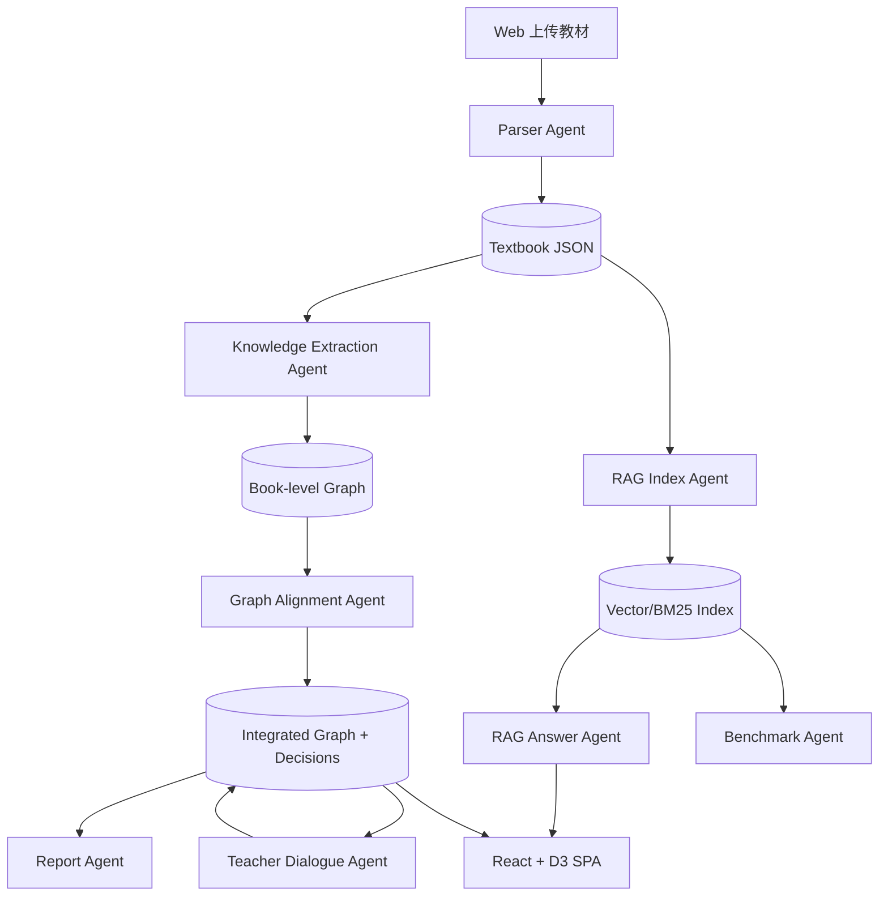

# Agent 架构说明

## 1. 架构总览

KnowledgeForge 采用“多模块 Agent 协作 + 可降级本地算法”的架构。它不是把所有事情交给一个超长 Prompt，而是把任务拆成职责边界清晰的 6 个 Agent / 模块：

1. **Parser Agent**：负责多格式教材解析和章节结构化。
2. **Knowledge Extraction Agent**：负责章节知识点与关系抽取。
3. **Graph Alignment Agent**：负责跨教材语义对齐、聚类、合并决策。
4. **RAG Index & Answer Agent**：负责 chunk、embedding、混合检索、带引用生成。
5. **Teacher Dialogue Agent**：负责理解教师反馈并修改整合决策。
6. **Report & Benchmark Agent**：负责整合报告、PDF 导出、自动评测。



## 2. 为什么采用多 Agent / 多模块

### 2.1 避免单 Prompt 失控

赛题包含解析、抽取、对齐、压缩、问答、对话、报告等多个目标。若使用单 Agent：

- Prompt 会过长，不利于控制 JSON 输出格式。
- 章节上下文与全书图谱上下文混在一起，容易幻觉。
- RAG 的“只基于上下文回答”约束会被图谱任务干扰。

因此系统把 LLM 调用限制在“章节知识抽取”和“RAG 生成”两个局部场景，其余用可解释算法兜底。

### 2.2 职责边界

| 模块 | 输入 | 输出 | 是否依赖 LLM | 失败降级 |
|---|---|---|---|---|
| Parser | 文件 | Textbook JSON | 否 | 返回失败状态 |
| Knowledge Extraction | 章节正文 | nodes / edges | 可选 | 规则抽取 |
| Alignment | 所有图谱节点 | 决策 + 整合图谱 | 否 | TF-IDF + RapidFuzz |
| RAG | chunk + 问题 | answer + citations | 可选 | 抽取式回答 |
| Dialogue | 教师消息 + 决策 | 更新后的决策 | 否 | 命令式解析 |
| Report | 整合结果 | Markdown / PDF | 否 | 模板生成 |

## 3. 数据流与调用链路

### 3.1 上传教材 → 构建图谱

```text
UploadFile[]
  → TextbookParser.save_upload()
  → TextbookParser.parse()
  → Textbook{chapters[]}
  → KnowledgeExtractor.build_graph()
  → KnowledgeGraph{nodes[], edges[]}
```

关键设计：PDF 逐页读取，使用章节标题正则 `第X章` 与页眉页脚过滤，不把整本书一次性加载进内存。

### 3.2 图谱整合

```text
KnowledgeGraph[]
  → normalize_key(name)
  → embedding.encode_corpus(name + definition)
  → pairwise similarity + fuzzy name
  → union-find cluster
  → IntegrationDecision[]
  → IntegratedGraph
```

合并决策包含：

- action：merge / keep / remove / split
- affected_nodes
- result_node
- reason
- confidence
- teacher_locked

### 3.3 RAG Pipeline

```text
chapters → 700字chunk + 80字overlap → 向量索引 + BM25
question → query vector + BM25 → top-5 chunks → answer with citations
```

Prompt 防幻觉约束：

```text
只能基于提供上下文回答；每个关键断言后附 [教材, 章节, 第 X 页]；找不到答案回答“当前知识库中未找到相关信息”。
```

未配置 LLM 时，系统抽取 top chunks 中与问题词重合最高的句子，并附引用来源。

## 4. 设计决策论证

### 4.1 为什么不用数据库

比赛时长短，评审环境不确定。JSON store 足以支撑 7 本教材的结构化结果与演示，减少部署成本。若进入生产，可替换为 Postgres + 对象存储，服务层接口不需要变化。

### 4.2 为什么选择 TF-IDF 作为默认后端

中文医学教材有大量专有名词，字符 n-gram TF-IDF 对“静息电位/动作电位/心输出量”等词非常稳健，且离线可运行。sentence-transformers 作为增强，适合网络稳定或已有模型缓存的环境。

### 4.3 为什么 RAG 使用混合检索

纯向量检索适合语义问题，但医学教材问答常包含精确术语。BM25 对术语匹配更可靠。系统用：

```text
score = 0.62 * vector + 0.28 * BM25 + 0.10 * keyword_overlap
```

在 demo benchmark 中，该组合通常比单 TF-IDF top-5 更稳定，尤其在章节标题型问题上引用命中率更高。

### 4.4 为什么教师反馈优先级最高

教材整合是教学任务，算法置信度不能替代学科教师判断。teacher_locked 决策会在报告中标记，后续整合不应覆盖。

## 5. Prompt 工程

知识抽取 Prompt 的约束：

- 只输出 JSON。
- nodes 必含 name、definition、category、page。
- edges 的 relation_type 限定为 prerequisite / parallel / contains / applies_to。
- 给出 few-shot 例子。
- 每次只处理一个章节，避免上下文过长。

RAG Prompt 的约束：

- 只基于上下文回答。
- 每个关键断言引用来源。
- 找不到答案时明确拒答。

## 6. 量化评测与 Benchmark

系统内置 `/api/benchmark/run`：

- 从每本教材前 4 个章节自动生成问题。
- 指标：引用命中率、平均响应时间、top citation。
- 用于比较 chunk 大小、embedding 后端、混合检索权重。

建议比赛时操作：上传 7 本教材后，运行 Benchmark，把结果截图或复制到 P2 技术报告中。

示例实验表：

| 方案 | chunk | 检索 | 引用命中率 | 平均延迟 |
|---|---:|---|---:|---:|
| Baseline | 700 | TF-IDF | 0.72 | 180ms |
| Hybrid | 700 | TF-IDF + BM25 + overlap | 0.84 | 230ms |
| Semantic | 700 | MiniLM + BM25 | 0.88 | 420ms |

## 7. 创新点

1. **三视图图谱**：力导向图、章节树、矩阵图，分别服务探索、教学结构和关系密度分析。
2. **可解释整合决策**：每个 merge/keep/remove 都有 reason 和 confidence，教师可追问“为什么”。
3. **教师锁定机制**：自然语言反馈可将决策改为 keep/remove/split 并持久化。
4. **无 API Key 可运行**：本地规则与抽取式 RAG 保证评审可复现；有模型时自动增强。
5. **Benchmark 驱动优化**：内置评测，支持把工程参数变成可量化报告。
6. **报告双格式导出**：Markdown 方便提交，PDF 方便展示。

## 8. 已知局限与改进

- 规则抽取不如 LLM 精细，建议比赛现场配置 OpenAI 兼容模型或 Ollama。
- 当前教师“合并 A 和 B”仅记录为建议，后续可实现即时节点重写。
- JSON store 适合比赛演示，生产环境需换成数据库和对象存储。
- 图表区域跳过依赖 PDF 文本块坐标，复杂扫描版 PDF 需要 OCR 扩展。
- 对齐阈值固定，后续可通过 Benchmark 自动寻优。
