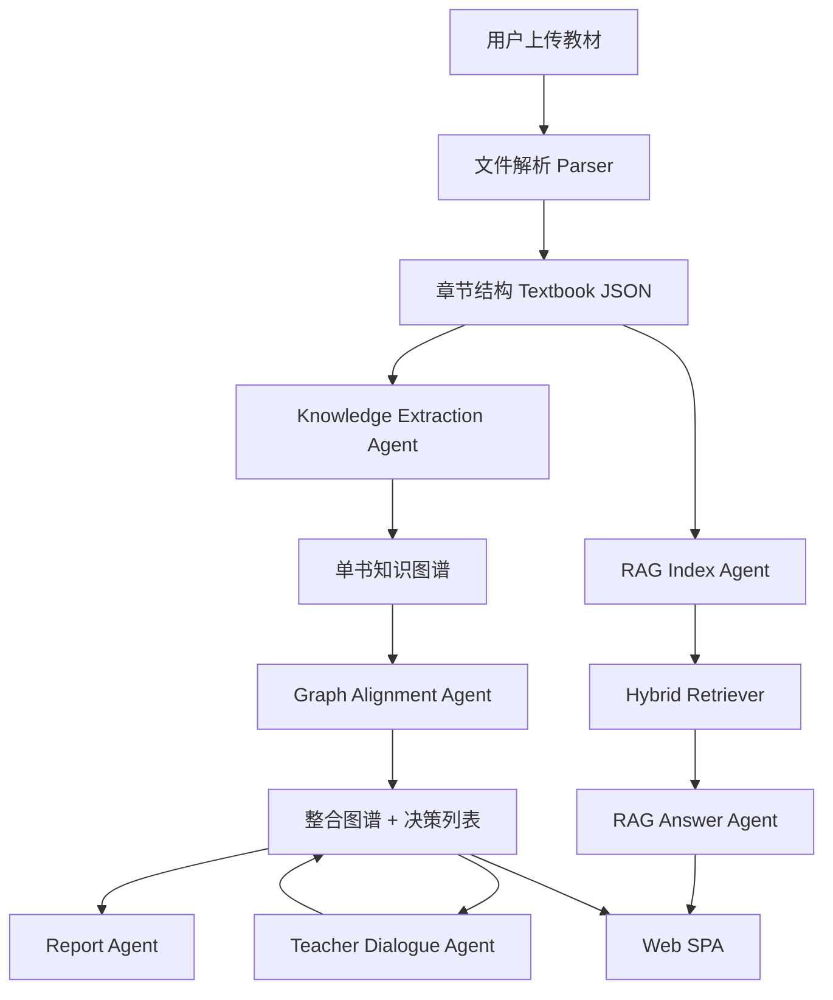

# 系统设计

## 1. 技术选型

| 层 | 技术 | 理由 |
|---|---|---|
| 前端 | React + Vite + TypeScript | Node 18/20 兼容，启动快，适合 SPA |
| 可视化 | D3.js | 可控力导向图、树图、矩阵图，支持拖拽缩放 |
| 后端 | FastAPI + Pydantic | Python 3.10 兼容，接口文档自动生成 |
| PDF 解析 | PyMuPDF | 支持逐页读取，避免一次加载整本书 |
| 中文处理 | jieba + regex | 轻量、可离线运行 |
| 检索 | TF-IDF / sentence-transformers + BM25 | 无网可跑，有模型可增强 |
| 报告 | Markdown + ReportLab PDF | 可复现，支持中文 PDF 导出 |
| 部署 | Docker Compose | 评审环境一键运行 |

## 2. 架构图

## 3. 数据流

### 上传教材

1. 前端 `POST /api/textbooks/upload` 上传多个文件。
2. 后端按格式解析，PDF 使用逐页读取、页眉页脚过滤、章节标题正则识别。
3. 输出统一结构：Textbook → chapters。

### 构建图谱

1. 前端选择教材并调用 `POST /api/graph/{id}/build`。
2. 后端优先用 LLM JSON 抽取；未配置 LLM 时使用规则抽取。
3. 输出 nodes / edges。

### 跨教材整合

1. `POST /api/integration/run` 自动补建缺失图谱。
2. 对所有节点做名称归一化、模糊匹配、向量相似度聚类。
3. 生成 merge / keep / remove / split 决策、压缩比、整合图谱。

### RAG 问答

1. `POST /api/rag/index` 将章节正文分为 700 字 chunk，overlap 80 字。
2. 使用向量 + BM25 建索引。
3. `POST /api/rag/query` 检索 top-5，上下文注入 LLM；无 LLM 时抽取高相关句。
4. 返回 answer + citations + source_chunks。

### 多轮对话

1. `POST /api/dialogue/message` 接受教师自然语言。
2. 规则解析保留 / 删除 / 拆分 / 为什么。
3. 更新决策并持久化对话历史。

## 4. 前端设计

- 左侧：上传、教材列表、章节结构。
- 中间：最大面积知识图谱，支持力导向 / 章节树 / 关系矩阵三视图。
- 右侧：整合、RAG、对话、报告、Benchmark。
- 节点大小映射频次，颜色映射教材来源，边颜色映射关系类型。

## 5. API 一览

| 方法 | 路径 | 功能 |
|---|---|---|
| POST | `/api/textbooks/upload` | 批量上传解析教材 |
| GET | `/api/textbooks` | 教材列表 |
| POST | `/api/graph/{textbook_id}/build` | 构建单书知识图谱 |
| GET | `/api/graph/{textbook_id}` | 获取图谱 |
| POST | `/api/integration/run` | 跨教材整合 |
| GET | `/api/integration` | 获取整合结果 |
| POST | `/api/rag/index` | 建立 RAG 索引 |
| POST | `/api/rag/query` | 带引用问答 |
| POST | `/api/dialogue/message` | 教师反馈对话 |
| POST | `/api/report/generate` | 生成报告 |
| GET | `/api/report/download` | 下载 Markdown / PDF 报告 |
| POST | `/api/benchmark/run` | RAG 自测 |
